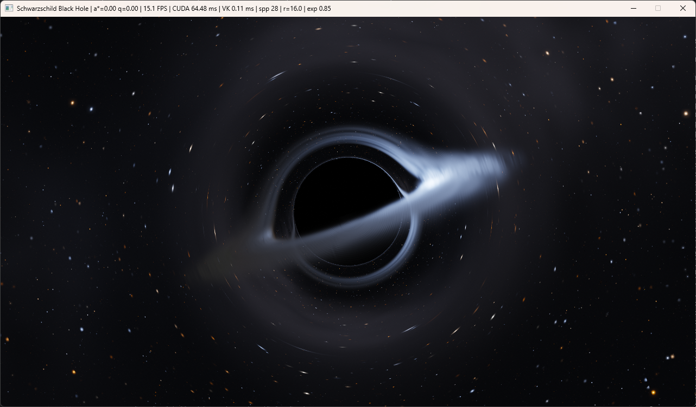

# Black Hole Renderer — Schwarzschild / Reissner–Nordström / Kerr / Kerr–Newman (CUDA + Vulkan)



A real-time, physically-motivated renderer of **four black hole families**
for **Windows x64**, switchable live:

| Key | Model | Spin a* | Charge q | Outer horizon r+ |
|---|---|---|---|---|
| F2 | Schwarzschild | 0 | 0 | 2M |
| F3 | Reissner–Nordström | 0 | ≠0 | M + √(M²−Q²) |
| F4 | Kerr | ≠0 | 0 | M + √(M²−a²) |
| F5 | Kerr–Newman | ≠0 | ≠0 | M + √(M²−a²−Q²) |

Geometric units G = c = 1, unified mass parameter M (rs = 2M; the default
mass scale M = 0.5 makes rs = 1 code unit, preserving the original scene
scale), **signed** dimensionless spin a* = a/M (negative = retrograde) and
charge q = Q/M. By default naked-singularity parameters (a*² + q² > 1) are
clamped inside the extremal bound with a console warning; press `N` to unlock
an experimental naked mode. Invalid inputs never produce NaN, flicker, or a crash.

Per-pixel **null geodesics are numerically integrated (RK4)** on the GPU
with **CUDA**; the HDR image is tone-mapped in the kernel and handed to
**Vulkan** for presentation via **GPU-side external-memory interop** — the
frame never touches the CPU.

No OpenGL, no Qt, no Python at runtime.

---

## 1. Requirements

| Component | Notes |
|---|---|
| Windows 10/11 x64 | NVIDIA GPU required (interop is single-GPU NVIDIA) |
| Visual Studio 2026 | "Desktop development with C++" workload |
| CMake ≥ 3.24 | bundled with VS or standalone |
| CUDA Toolkit 12.x | installed with Visual Studio integration (`nvcc` / `CUDA_PATH`) |
| Vulkan SDK (LunarG) | installer sets `VULKAN_SDK` |
| vcpkg | set `VCPKG_ROOT` (or install at `C:\vcpkg`) |

The only third-party library is **glfw3**, pulled automatically by the
vcpkg manifest (`vcpkg.json`) during CMake configure.

## 2. Build & Run

```bat
build.cmd configure   :: CMake configure (VS 2026 generator, x64, vcpkg toolchain)
build.cmd build       :: configure (if needed) + compile, Release
build.cmd run         :: build (if needed) + launch blackhole.exe
build.cmd test        :: build + run the GPU verification suite
build.cmd clean       :: delete the build directory
build.cmd rebuild     :: clean + configure + build
build.cmd run debug   :: same actions with the Debug configuration
```

Manual equivalent:

```bat
cmake -S . -B build -A x64 -DCMAKE_TOOLCHAIN_FILE=%VCPKG_ROOT%\scripts\buildsystems\vcpkg.cmake
cmake --build build --config Release --parallel
build\Release\blackhole.exe
```

**Headless stills** — `blackhole_snapshot.exe` runs the exact interactive
pipeline (jittered samples → accumulation → glare → tone mapping) without a
window and writes a PNG, for offline renders and before/after comparisons:

```bat
build\Release\blackhole_snapshot.exe out.png spp=64
build\Release\blackhole_snapshot.exe kerr.png model=2 a=0.9 el=0.12 spp=64 w=1920 h=1080
```

Keys: `model a q az el dist fov spp w h exp bloom disk spots t quality`,
plus look-dev overrides `temp emis abs glare` (see `tools/snapshot.cu`).

Tip: for a much faster first compile targeting only your GPU, add
`-DCMAKE_CUDA_ARCHITECTURES=native` to the configure step (default builds
for SM 61/75/86/89).

## 3. Controls

| Input | Action |
|---|---|
| Left mouse drag | Orbit camera (azimuth / elevation) |
| Mouse wheel, `W`/`S` | Camera distance (clamped to stay outside 2.2 rs) |
| `A`/`D`, `Q`/`E` | Azimuth / elevation via keyboard |
| `X` / `Y` / `Z` | Rotate black hole about world **X / Y / Z** (hold; **Shift** reverses) |
| `R` | **Reset** orientation + camera to defaults |
| `-` / `=` | Exposure down / up |
| `1` / `2` / `3` | Quality preset: fast / balanced (default) / high |
| `F2` `F3` `F4` `F5` | Model: Schwarzschild / Reissner–Nordström / Kerr / Kerr–Newman |
| `[` / `]` | Spin a* down / up (Kerr, Kerr–Newman; **signed**, a* < 0 = retrograde; hold to repeat) |
| `,` / `.` | Charge q down / up (RN, Kerr–Newman; hold to repeat) |
| `N` | Toggle **naked-singularity mode** (experimental; allows a*²+q² > 1) |
| `H` | Toggle **orbiting hot spots** (ISCO flares → moving photon-ring arcs) |
| `B` | Toggle HDR bloom |
| `F1` | Toggle accretion disk |
| `F11` | Toggle native fullscreen on the current monitor |
| `SPACE` | Pause / resume disk animation |
| `ESC` | Quit |

FPS, average CUDA kernel time and Vulkan present time are shown in the
window title (updated every 0.5 s) and logged to the console every ~2 s.

## 4. How the CUDA ↔ Vulkan interop works (no CPU copies)

1. **Vulkan owns the memory.** `VulkanContext::createInteropBuffer` creates a
   `VkBuffer` (width × height × 4 bytes) whose device memory is allocated with
   `VkExportMemoryAllocateInfo` (`VK_EXTERNAL_MEMORY_HANDLE_TYPE_OPAQUE_WIN32_BIT`)
   and exported as a Win32 handle via `vkGetMemoryWin32HandleKHR`.
2. **CUDA imports it.** `CudaInterop::init` calls `cudaImportExternalMemory`
   + `cudaExternalMemoryGetMappedBuffer`, yielding a device pointer that
   aliases the very same VRAM. The render kernel writes `uchar4` pixels
   directly into it.
3. **Same physical GPU is enforced.** Vulkan reports its
   `VkPhysicalDeviceIDProperties::deviceUUID`; the CUDA device is selected by
   matching `cudaDeviceProp::uuid`. If no match exists the app aborts with a
   clear error (interop across different GPUs is not supported).
4. **GPU-side synchronization with two exported binary semaphores**
   (`VK_EXTERNAL_SEMAPHORE_HANDLE_TYPE_OPAQUE_WIN32_BIT`, imported with
   `cudaImportExternalSemaphore`):
   - `semCudaToVk`: CUDA signals after the kernel; Vulkan's submit waits on it.
   - `semVkToCuda`: Vulkan signals when the copy finished; CUDA's next frame
     waits on it (skipped on frame 0).
5. **Presentation.** Each frame Vulkan submits a pre-recorded command buffer:
   layout barrier → `vkCmdCopyBufferToImage` into the acquired swapchain image
   → barrier to `PRESENT_SRC` → `vkQueuePresentKHR`. The copy is a pure
   GPU-to-GPU transfer; the image never leaves the GPU and is never mapped,
   read back, or re-uploaded by the CPU.

## 5. Physics & rendering effects implemented

- **True geodesic integration, not screen-space warping — in every model.**
  - *Schwarzschild & Reissner–Nordström* (spherically symmetric): each ray's
    orbital plane hosts the generalized Binet equation
    `u''(φ) = 3M u² − 2Q² u³ − u` (u = 1/r), integrated with classic RK4 in
    the orbital angle. For Q = 0 this is exactly the original Schwarzschild
    path.
  - *Kerr & Kerr–Newman*: full **3D null geodesics in Boyer–Lindquist
    coordinates** — not a 2D equation with a cosmetic twist. The first-order
    Hamiltonian system for (r, θ, φ, p_r, p_θ) with conserved E = −p_t and
    L_z = p_φ is integrated with RK4 and an **adaptive affine step** that
    shrinks near the horizon and inside the photon region; dp_r/dλ and
    dp_θ/dλ use the full partial derivatives of H, keeping the null
    constraint conserved (monitored by the test suite: median
    |K|/(E²(r²+a²)) ≈ 2·10⁻⁶ along a*=0.9 rays).
  - **Camera mapping through a static-observer frame in all models:** pixel
    directions live in the observer's local orthonormal frame and are
    converted to coordinate 4-momenta — via the √f(r₀) factor in the
    spherical path and a full static-observer **tetrad** in Boyer–Lindquist
    for Kerr/KN. Euclidean direction vectors are never used directly as
    geodesic derivatives. (This mapping is what makes the rendered shadow
    boundary match theory to <0.1%, see Testing.)
- **Robust termination:** capture at the outer horizon r+, escape beyond
  r = 120M with outward motion, NaN/Inf guards (treated as captured), a hard
  step budget, pole-reflection guards for near-axis rays, and a
  straight-line fallback for degenerate purely-radial rays.
- **Model-dependent optics (verified numerically, see Testing):** the shadow,
  photon region and deflection field shrink with charge q; spin drags frames,
  displacing and asymmetrizing the shadow and the higher-order images;
  Kerr–Newman combines both effects.
- **Pitch-black event horizon** — captured rays contribute no light.
- **Gravitational lensing** of a procedural background starfield: the escape
  direction of the bent geodesic samples the sky, producing continuous
  distortion and Einstein-ring behaviour around the shadow.
- **Photon ring:** rays passing near the r = 1.5 rs photon sphere wind around
  the hole multiple times and sample the disk/sky repeatedly, so the bright
  thin ring at the shadow edge **emerges from the integration itself**.
- **Optically thick, geometrically thin accretion disk** (inner edge = the
  **numerically computed ISCO of the current model** — 6M for
  Schwarzschild, sweeping in toward the horizon with prograde spin — out to
  **~16M** by default; Gaussian vertical profile with H/R ≈ 0.012–0.022,
  mildly flared). It is integrated along the geodesic as an **LTE
  absorber/emitter**: per sub-step I += T·S·(1 − e^{−α ds}), T *= e^{−α ds},
  with source function S = Planck radiance. The inner disk has τ ≈ 20
  (a solid photosphere, independent of path length) and thins out in the
  outer taper, where clumpy opacity makes it wispy. The disk correctly
  appears in front of, behind (lensed over/under), and inside the photon
  ring, and occludes the stars behind it.
- **Alias-free disk sampling:** segments are clipped to the disk slab and
  sub-stepped at ≤ 0.4 H vertically and ≤ 0.1 units along the ray, with a
  per-pixel, per-sample golden-ratio offset. Progressive accumulation
  therefore converges instead of freezing the sampling pattern into
  moiré / wood-grain bands.
- **Novikov–Thorne thin-disk flux** F(r) ∝ r⁻³ (1 − √(r_in/r)) with an
  inner peak just outside the ISCO → T_eff ∝ F^{1/4}. `diskTemp` (default
  5200 K, a cool low-Eddington supermassive disk) is the Schwarzschild peak.
  At a fixed accretion rate T_peak ∝ r_in^{−3/4}, so prograde spin and charge
  (smaller ISCO, higher efficiency) run hotter and retrograde spin runs
  cooler.
- **Unified GR emitter model (all four metrics):** photon conserved (E, L_z)
  from a static-observer tetrad at the camera; circular Keplerian Ω(r) from
  the metric; redshift factor
  **g = 1 / [uᵗ (E − Ω L_z)]** (gravitational redshift + Doppler beaming +
  frame dragging when a ≠ 0). Since I_ν/ν³ is invariant, a Planck emitter
  at T seen with factor g is **exactly a Planck spectrum at gT**. The
  renderer looks up **B(gT) integrated against the CIE 1931 colour-matching
  functions** (generated table `src/blackbody_lut.h`, linear sRGB / D65,
  absolute photometric scale), so colour shift *and* visible-band beaming
  both come out of the spectrum; there's no ad-hoc g³/g⁴ factor. The
  approaching side is white-hot (a blue tinge on the beamed photon ring
  of Kerr), and the receding side and outer annulus fall through gold into
  orange.
- **Camera metering:** a hotter disk is far brighter in the visible band,
  so exposure adapts, like any camera or eye. It compensates 60% (in log)
  of the model's peak-luminance change relative to Schwarzschild. Switching
  to a rapidly spinning Kerr hole therefore doesn't blow out, and a
  retrograde disk isn't murky. The `-`/`=` keys still apply on top.
- **HDR display pipeline with progressive anti-aliasing:** every frame
  traces one jittered sub-pixel sample (R2 low-discrepancy sequence) into a
  linear-HDR float4 accumulation buffer. While the camera and model are
  held still the image *refines itself*, converging to supersampled quality
  within a fraction of a second (the title bar shows the accumulated `spp`);
  any view change instantly resets to the ordinary single-sample image, so
  interaction latency is unchanged. With the disk animating, an exponential
  moving average provides temporal anti-aliasing plus a mild, physically
  reasonable motion blur of the orbiting gas. Exposure and bloom apply
  *after* accumulation, so adjusting them never resets convergence.
- **Lens glare** (`B` to toggle): modelled as a low-energy two-scale PSF
  wing rather than a heavy bloom. A gentle bright-pass at half resolution
  feeds a separable 9-tap Gaussian (σ ≈ 6 px), then a quarter-resolution
  level (σ ≈ 13 px). Only ~14% of bright-source energy is spread, so the
  photon ring, beamed disk and bright stars glow like through real optics
  without softening the image. Negligible cost next to the geodesics.
- **Tone mapping & quantization:** exposure → ACES filmic → gamma 2.2 →
  triangular-pdf spatial dither → 8-bit (R/B swap for BGRA swapchains). The
  dither removes 8-bit banding in the dark background and is static per
  pixel, so a converged image is perfectly still.
- **Sheared MRI-like turbulence:** seam-free 3D noise on (ln r, cos φ′,
  sin φ′) in the co-rotating frame, billowy at large scales and ridged
  (filamentary) at small ones. It modulates temperature (±~10% in T, i.e.
  ±~40% in visible brightness) and opacity. Each of two layers is born
  unsheared and winds into **trailing spirals** under the Keplerian Ω(r),
  as a real eddy does. The layers are crossfaded half a period apart and
  reset while invisible, so the texture never winds up into aliasing rings
  however long the app runs. **Slow-light** advection (emission time =
  observation time − geodesic flight time) is preserved; SPACE pauses.
- **Procedural starfield of point sources:** each star has a fixed
  integrated flux (steep power law: many faint, very few bright) and a real
  blackbody chromaticity, partially desaturated as a sensor records it.
  Halos are *not* painted into the sky, where lensing would smear them into
  streaks; glare comes from the screen-space PSF. **Lensed stars stay
  points:** about the camera–hole axis the lens map is (exactly for
  Schwarzschild/RN, approximately for Kerr) axisymmetric. Its tangential
  magnification is μ_t = sin α_image / sin β_source, so each star's sky
  kernel is shrunk by μ_t along the tangential direction. Stars near the
  Einstein ring brighten as magnified point sources should, instead of
  turning into arcs.
- **Milky Way** tilted ~31° to the disk plane and crossing the default view
  diagonally: a faint band and bulge of unresolved starlight with dust
  lanes, plus a denser faint star population toward the galactic plane.
  The old in-plane band, lensed into a uniform gray fog ring around the
  hole, is gone.
- **Starfield energy shift:** escaped rays sample the sky with the static
  observer's camera g-factor (bolometric g⁴ intensity scaling), so the
  background is no longer energy-blind.
- **Orbiting hot spots** (`H`, on by default with the disk): one–two compact
  flares just outside the ISCO co-rotate at Ω(r) with mild flicker. The same
  geodesic integrator lenses them into the **photon ring** (including lagged
  higher-order images via slow light) — ring motion is emergent, not a 2D
  overlay. SPACE freezes the pattern; animation uses a slightly shorter TAA
  window so the arcs stay readable.

## 6. Verification & testing status — please read

### Executable verification suite (`build.cmd test`)

`blackhole_tests.exe` (CUDA console app, no Vulkan needed) runs the *same*
device integrators as the renderer on grids of camera rays and asserts,
with explicit tolerances:

- **T1** Event-horizon radii match the closed-form theory for all four
  models (r+ = M + √(M²−a²−Q²) and each special case), plus
  Schwarzschild identities: r+ = 2M, photon sphere 3M, ISCO 6M (numeric).
- **T2** Validation rejects/clamps q² > 1, a*² > 1, a*² + q² > 1, NaN
  mass/spin/camera, zero step size, zero step budget.
- **T3** Consistency limits: RN(q=0) ≡ Schwarzschild and KN(q=0) ≡ Kerr
  (same integrator, tight tolerance); Kerr(a*=0) ≈ Schwarzschild,
  KN(a*=0,q) ≈ RN(q), KN(0,0) ≈ Schwarzschild (cross-integrator, 2D Binet
  vs 3D Boyer–Lindquist). Also: the RN shadow must shrink with q.
- **T4** Null-geodesic Hamiltonian constraint |K|/(E²(r²+a²)) stays small
  along Kerr a*=0.9 and KN a*=0.7 q=0.5 rays (median and max asserted).
- **T5** Convergence: halving the step quality (and doubling the step
  budget, twice) changes escape directions less and less; the
  Schwarzschild shadow boundary is bisected and compared against
  b_crit = 3√3 M (assert < 1% relative error).
- **T6** Stability smoke tests: full renders with zero step size, zero max
  steps, NaN camera and naked-singularity parameters complete with no CUDA
  error and fully written output.

### What was executed where

The Windows CUDA+Vulkan binaries were not built in the authoring
environment (Linux container, no GPU/MSVC/Vulkan SDK); you confirmed the
baseline builds on the target machine, and `build.cmd test` is how the GPU
suite is meant to be run there. However, the physics was **actually
executed and validated on the CPU** in the authoring environment: because
all integrators live in `trace.cuh` as pure math, the identical code was
compiled with a host compiler and run through the same test battery.
Measured results on the final sources:

- Schwarzschild shadow boundary vs b_c = 3√3 M: **0.000% relative error**
  (bisection-limited); RN q=0.6 vs b_c = r_ph/√f(r_ph): **0.000%**.
- Kerr(a*=0) vs Schwarzschild across 1681 rays: 0 classification
  mismatches, **median escape-direction difference 5.7·10⁻⁶ rad** (the two
  independent integrators agree to float precision; only rays hugging the
  photon ring diverge, as they must).
- KN(a*=0.6, q=0) vs Kerr(a*=0.6): **bitwise identical**.
- Hamiltonian constraint along a*=0.9 rays: median 1.9·10⁻⁶, max < 10⁻².
- Frame dragging at a*=0.9: equatorial shadow displaced and narrowed
  relative to Schwarzschild (measured on the image grid).
- All invalid-input cases sanitized; traces terminate cleanly.
- The display-quality pipeline (accumulation, bloom, dithered composite)
  was executed on the CPU through the same shared device helpers, and the
  rendered Schwarzschild and Kerr images were visually inspected: correct
  shadow/ring/disk, bloom confined to hot regions, no artifacts. An 8-sample
  progressive accumulation measured **1.78× lower full-image RMS error**
  against a 64-sample reference (gains concentrated on silhouette edges),
  and repeat renders are bit-identical (the GPU suite asserts determinism,
  poisoned-accumulation recovery and sanitation of the new fields in T6).

GPU execution can differ from CPU only through `--use_fast_math` rounding;
the suite's tolerances leave ample margin for that.

### Performance of the rotating models

The Kerr/Kerr–Newman integrator was profiled (on CPU, as a proxy for
relative GPU cost — absolute GPU timings must come from the on-screen
counters) and optimized without any measurable accuracy change in the full
validation battery:

- The adaptive step controller's budgets were re-derived to match the
  spherical integrator's accuracy scale (angular advance ~2.2·dPhi rad per
  RK4 step, fractional horizon approach ~8·dPhi, both scaling with the
  1/2/3 quality presets; extra refinement inside the photon region).
- Steps grow linearly with r in the weak field instead of a flat spatial
  cap, so far-field flight costs a handful of steps.
- The fine spatial cap needed for volumetric disk sampling applies only
  inside the disk's radial band near the equatorial slab.
- Disk segments that cannot touch the disk annulus are culled radially
  before sub-sampling; when the disk is toggled off, the rotating path
  skips per-step Cartesian conversion entirely.
- Trigonometry uses the fused `__sincosf` device intrinsic.

The spherical (Schwarzschild / Reissner–Nordström) integrator uses the same
idea: the angular RK4 step grows linearly with r (up to 6× dPhi) in the
weak field where the Binet equation is nearly linear, keeps full dPhi
resolution below r ≈ 9M, and shrinks for near-radial rays so |Δu| per step
stays bounded — shadow-boundary classification and the step-halving
convergence order are unchanged. Disk sampling additionally gates all noise
evaluation behind the (cheap) Novikov–Thorne flux test, and the geodesic
trace kernel launches as 128-thread blocks for better occupancy.

Measured on the shared integrator code (140×140 rays, default camera,
balanced preset): Kerr a\*=0.9 with disk **4.5× faster** than the initial
implementation (Kerr–Newman 3.5×; disk-off Kerr 5.2×), bringing the
rotating models to ~2.3× the cost of Schwarzschild per frame (previously
~8.6×). Average integration steps per ray dropped from ~900 to ~197. As a
side effect the retune also fixed a subtle issue: at the default step
budget the old controller could exhaust `maxSteps` on photon-ring-adjacent
rays and misclassify them as captured; the new controller leaves zero
budget-exhausted rays at identical converged classifications.

The full physics battery (shadow radii vs theory to 0.000%, all five model
reductions, Hamiltonian constraint, frame-dragging displacement,
step-halving convergence) passes unchanged on the optimized code.

## 7. Known limitations

- **Radiative transfer is still approximate:** gray (frequency-independent)
  opacity with a Planck LTE source function and parameterized density /
  opacity scales, no limb darkening, no Compton-hardened (colour-corrected)
  spectrum, no polarization (ipole-class RT remains out of scope). The
  point-star lens map uses the axisymmetric tangential magnification only
  (the radial magnification is not applied).
- **Naked singularities** are opt-in (`N`): by default parameters stay inside
  a*² + q² ≤ 0.995. In naked mode rays terminate on a small coordinate cut
  (r ≈ 0.05 M) rather than a true curvature singularity treatment.
- **Spin is signed** (a* ∈ [−0.995, 0.995] by default; co-rotating disk/ISCO).
- Disk turbulence uses **slow-light** advection (t_emit = t_obs − Δt along the
  backward geodesic) plus sheared, crossfaded 3D noise —
  still **not a GRMHD simulation** (no live MHD, no precomputed dump loading
  yet).
- Camera placement uses r = |x| spherical mapping rather than the oblate
  Boyer–Lindquist embedding (negligible at camera distances ≥ 2.2 units).
- Windowed mode is fixed at 1280×720; `F11` switches to native fullscreen
  on the current monitor and renders at that fullscreen resolution, increasing
  GPU cost accordingly.
- Binary-semaphore ping-pong serializes CUDA and Vulkan per frame (no
  multi-frame kernel pipelining).
- Single-GPU NVIDIA only; hybrid laptops must run the app on the NVIDIA GPU
  (Windows Graphics settings → High performance) or device matching fails.

## 8. Project layout

```
CMakeLists.txt              CMake project (CXX + CUDA, VS 2026 / x64)
build.cmd                   configure | build | run | clean | rebuild
vcpkg.json                  manifest (glfw3)
src/
  main.cpp                  window loop, orbit camera, input, model switching
  vulkan_context.{h,cpp}    instance/device/swapchain, exportable buffer
                            + semaphores, copy-and-present command buffers
  cuda_interop.{h,cpp}      external memory/semaphore import, kernel dispatch,
                            CUDA event timing, device-UUID matching
  black_hole_kernel.cu      per-pixel kernel + sanitizing launcher
  trace.cuh                 shared device physics: generalized Binet
                            integrator (Schw/RN), Boyer-Lindquist
                            Hamiltonian integrator (Kerr/KN), tetrad camera
                            mapping, LTE disk transfer with exact
                            g-factor, point-source starfield + lens map
  metric.cuh                Kerr-Newman metric math, horizons, photon
                            region, numeric ISCO, validation/clamping,
                            parameter sanitation (host + device)
  render_params.h           POD shared between host and device
  kernel_launch.h           launch wrapper macro
  post_process.cuh          accumulation, two-scale glare, ACES, dither
  blackbody_lut.h           generated CIE 1931 Planck -> linear sRGB table
  vec_math.cuh              device float2/3 math, hashing, 2D/3D fBm noise
  logger.h                  timestamped console logging
tests/
  test_main.cu              GPU verification suite (build.cmd test)
tools/
  snapshot.cu               headless PNG renderer (blackhole_snapshot.exe)
  gen_blackbody_lut.py      regenerates src/blackbody_lut.h
```
